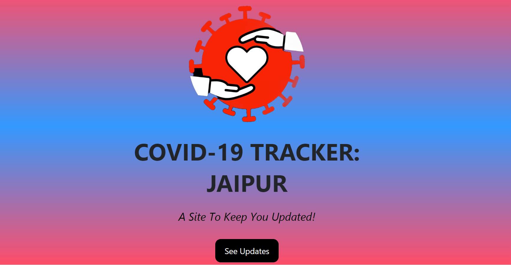

# COVID-19-Tracker Jaipur

#### Description

The Project is a Single Page Web Application which provides the information about the COVID-19 cases in Jaipur Area-wise as well as Total,Active,Recovered and Deaths cases in Jaipur City.The Web Page Gets Regularly Updated(Till:22/07/2020).
The idea behind the project was to make the citizens of Jaipur aware about then current situation of their areas.

**Note** : The Web Page Was Last Updated As On 22/07/2020.

###### Live Demo : https://blooming-cove-31259.herokuapp.com/

###### Technologies: HTML, CSS, JavaScript,Bootstrap,Node.js,Express,MongoDB Atlas
----------------------------------------------------------------------------------------------------------------
To setup the project on your local machine:

1. Click on `Fork`.
2. Go to your fork and `clone` the project to your local machine.
3. `git clone https://github.com/COVID19-Tracker-For-Jaipurites/COVID-19-.git`
4. Install all the dependencie mentioned in package.json file of the project by using npm (npm i dependencie_name).
5. And run the local server on port 3000.

To contribute to the project:

1. Choose any open issue from [here]  https://github.com/COVID19-Tracker-For-Jaipurites/COVID-19-/issues.
2. Comment on the issue: `Can I work on this?` and get assigned.
3. Make changes to your fork and send a PR.

To create a PR:

Follow the given link to make a successful and valid PR: https://github.com/COVID19-Tracker-For-Jaipurites/COVID-19-/pulls .

To send a PR, follow these rules carefully,**otherwise your PR will be closed**:

1. Make PR title in this format: `Fixes #IssueNo : Name of Issue`

For any doubts related to the issues, i.e., to understand the issue better etc, comment down your queries on the respective issue.

**If you liked the project,  Please do :star: star the repository .**

 
